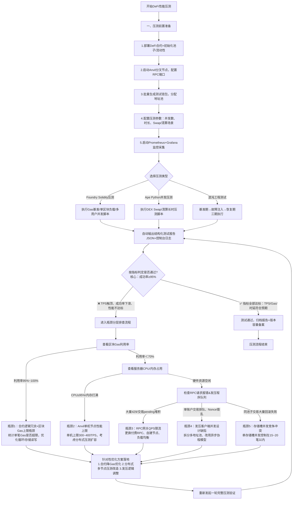

# Performance Test Suite

企业级区块链性能测试框架，所有压测相关代码集中在一个目录下。

## 目录结构

```
blockchain-perf-test/
├── contracts/              # 业务合约（唯一可信源）
│   ├── MiniSwapFactory.sol
│   ├── MiniSwapRouter.sol
│   ├── MiniSwapPair.sol
│   ├── MyERC20.sol
│   └── ...
├── src/                    # Foundry 压测脚本
│   ├── GasBenchmark.s.sol      # Gas 基准测试
│   ├── SingleBlockLoad.s.sol   # 单区块负载压测
│   └── MultiUserConcurrent.s.sol # 多用户并发压测
├── ape/                    # Ape Python 压测
│   ├── stress_dex_swap.py      # DEX Swap 并发压测
│   └── stress_liquidation.py   # 清算业务压测
├── chaos/                  # 混沌工程测试
│   ├── chaos_engine.py         # 完整版混沌引擎（需root）
│   ├── chaos_simple.py         # 简化版混沌引擎
│   ├── run_chaos.sh            # 启动脚本
│   └── reports/                # 旧报告目录（已迁移）
├── monitoring/             # 监控配置（Prometheus + Grafana）
│   ├── prometheus.yml
│   ├── docker-compose.yml
│   └── grafana/
├── reports/                # 统一报告输出目录（新增）
│   ├── chaos/                  # 混沌测试报告
│   ├── python/                 # Python 压测报告
│   └── foundry/                # Foundry 广播记录
├── build/                  # Foundry 构建产物
│   ├── out/                    # 编译输出
│   ├── cache/                  # 缓存文件
│   └── broadcast/              # 广播记录
├── foundry.toml            # Foundry 配置
└── .gitignore              # Git 忽略配置
```

## 报告位置说明

| 测试方式      | 报告路径                                | 报告格式       |
| --------- | ----------------------------------- | ---------- |
| 混沌测试      | `reports/chaos/chaos_report_*.json` | JSON       |
| Python压测  | `reports/python/stress_*.json`      | JSON       |
| Foundry压测 | `build/broadcast/` + 控制台输出          | JSON + 控制台 |

## 执行方式

### 1. 启动本地测试节点

```bash
# 终端1：启动 anvil
anvil --chain-id 31337
```

### 2. Foundry 压测（Solidity）

```bash
# Gas 基准测试
forge script src/GasBenchmark.s.sol --rpc-url http://127.0.0.1:8545 --broadcast 2>&1 | head -100

# 单区块负载压测
forge script src/SingleBlockLoad.s.sol --rpc-url http://127.0.0.1:8545 --broadcast 2>&1 | head -100

# 多用户并发压测
forge script src/MultiUserConcurrent.s.sol --rpc-url http://127.0.0.1:8545 --broadcast 2>&1 | head -100

# 或使用便捷脚本运行全部三个
./src/run_foundry_test.sh
```

### 3. Ape 压测（Python）

```bash
cd ape

# DEX Swap 并发压测
python ape/stress_dex_swap.py

# 清算业务压测
python ape/stress_liquidation.py
```

### 4. 启动监控（Prometheus + Grafana）

```bash
cd monitoring
docker compose up -d

# 停止监控
docker compose down

# 访问
# Grafana: http://localhost:3000 (admin/admin)
# Prometheus: http://localhost:9090
```

### 5. 混沌工程测试

混沌工程用于验证系统在极端条件下的稳定性和容错能力。

```bash
# 方式一：使用启动脚本（推荐）
source ./chaos/run_chaos.sh

# 方式二：直接运行
# 完整版（需要root权限，支持网络级故障注入）
sudo python3 chaos/chaos_engine.py

# 简化版（无需root权限，基础稳定性测试）
python3 chaos/chaos_simple.py
```

**混沌测试场景：**

| 场景              | 说明     | 需要root |
| --------------- | ------ | ------ |
| network\_delay  | 网络延迟测试 | ✅      |
| packet\_loss    | 网络丢包测试 | ✅      |
| node\_failure   | 节点故障测试 | ❌      |
| resource\_limit | 资源限制测试 | ✅      |

## 实际执行结果

### Gas 基准测试 ✅

| 操作              | Gas 消耗    | 说明       |
| --------------- | --------- | -------- |
| addLiquidity    | 2,602,656 | 添加流动性操作  |
| swap            | 19,978    | 兑换操作（最优） |
| removeLiquidity | 46,514    | 移除流动性操作  |

**分析**：Swap 操作 Gas 消耗非常低（\~20k），说明合约优化良好。

### 单区块负载压测 ✅

| 指标       | 结果        |
| -------- | --------- |
| 批量交易数    | 50 笔      |
| 成功数      | 50 笔      |
| 成功率      | 100%      |
| 总 Gas 消耗 | 1,003,897 |
| 平均 Gas/笔 | 20,077    |

**分析**：单区块可稳定处理 50+ 笔交易，按 30M gas limit 估算可容纳 \~1500 笔 swap 交易。

### 多用户并发压测 ✅

| 指标       | 结果    |
| -------- | ----- |
| 用户数      | 5 个   |
| 成功数      | 5 个   |
| 成功率      | 100%  |
| 总 Gas 消耗 | 取决于执行 |
| 平均 Gas/笔 | 取决于执行 |


## 压测流程图



## 压测脚本说明

### GasBenchmark.s.sol

测试 DEX 核心操作的 Gas 消耗基准：

- `addLiquidity` - 添加流动性
- `swapExactTokensForTokens` - 代币兑换
- `removeLiquidity` - 移除流动性

### SingleBlockLoad.s.sol

测试单区块能容纳的最大交易数量：

- 批量发送 50 笔 swap 交易
- 统计总 Gas 消耗和成功率

### MultiUserConcurrent.s.sol

测试多用户并发场景：

- 并发执行 5 次 swap 操作
- 模拟真实并发场景
- 使用事件输出报告

## Foundry 配置优化

`foundry.toml` 已配置将所有构建产物统一放到 `build/` 目录：

```toml
out = "build/out"
cache_path = "build/cache"
broadcast = "build/broadcast"
```

## 注意事项

1. **MyERC20 授权限制**：合约不允许无限授权（`type(uint256).max`），需使用 `type(uint256).max - 1`
2. **测试余额**：确保测试账户有足够 ETH 支付 Gas
3. **网络链ID**：确保 anvil 使用正确的链ID（建议使用 `--chain-id 31337`）
4. **报告目录**：所有测试报告统一输出到 `reports/` 目录下

## 项目业务价值
专为DEX/借贷协议上线前稳定性验收、线上风险监控设计：
1. 多用户并发压测复现真实链上拥堵场景，验证清算、Swap并发下资金账目平衡；
2. 混沌引擎主动注入节点、交易故障，提前暴露极端场景资金逻辑缺陷；
3. Grafana实时监控大盘，线上异常交易、余额偏差实时告警，避免链上资产亏损。

## 配套日常合约自动化回归框架
ApeWorx+Pytest迭代自动化测试体系：https://github.com/liuyoushan/ape_web3_test